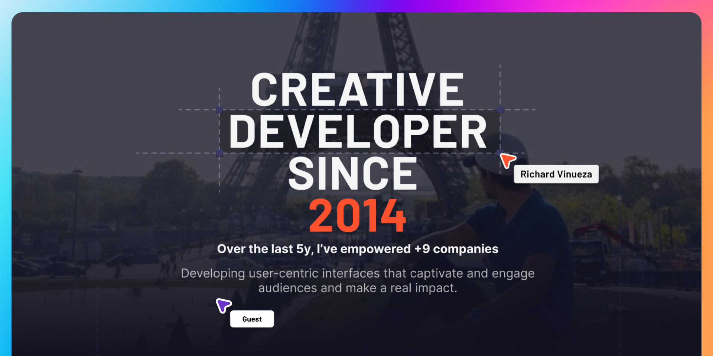

#### Connect with me:

  
  
  
  

<table align="center">
  <tr>
    <!-- <td align="center">
      
    </td> -->
    <td align="center">
      
      
<strong>PORTFOLIO</strong> - <a href="https://rbvn.vercel.app" target="_blank">CLICK TO VISIT</a>

    </td>
  </tr>
</table>

[website]: https://rbvn.vercel.app
[twitter]: https://twitter.com/richard-vinueza
[youtube]: https://youtube.com/richardvnarvaez
[instagram]: https://instagram.com/richard.vinueza
[linkedin]: https://linkedin.com/in/richardvnarvaez
[hackerrank]: https://www.hackerrank.com/richardnarvaez
[leetcode]: https://leetcode.com/richardnarvaez/
